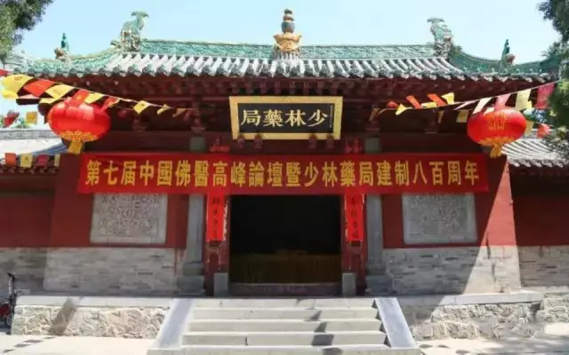
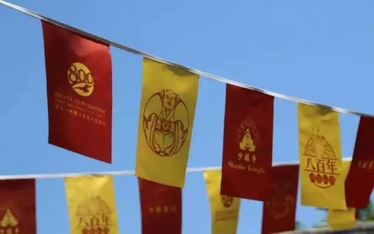
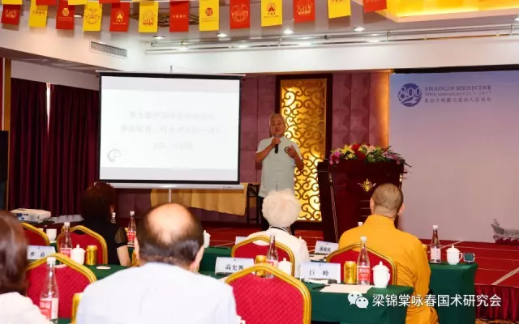
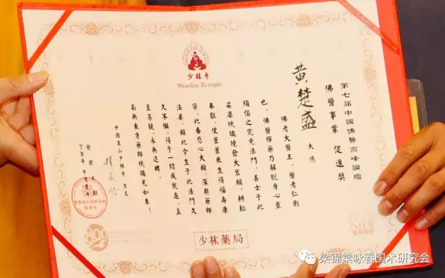
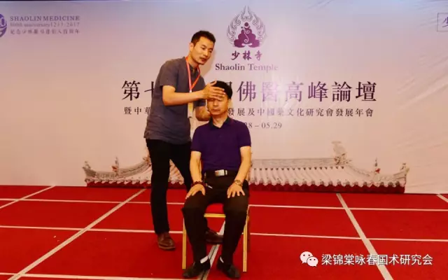
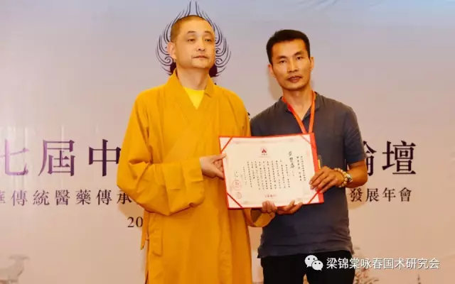
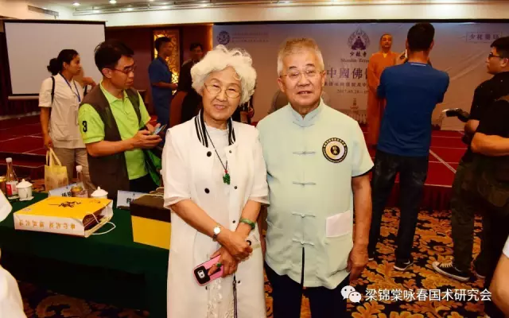
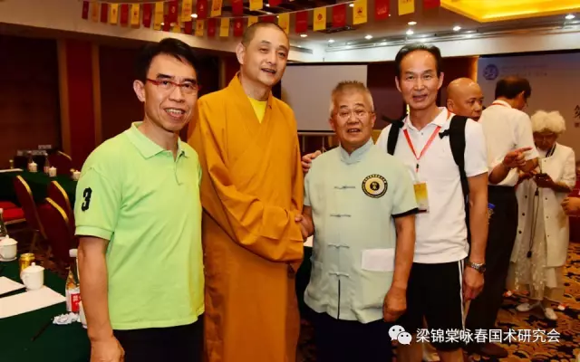
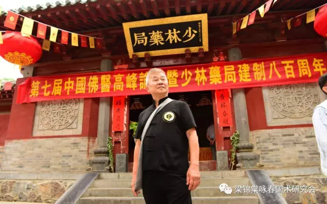
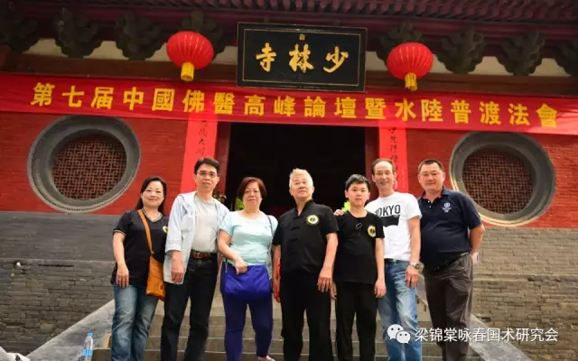

2017年5月28日-29日，適逢少林藥局成立800週年，「第七屆中國佛醫高峰論壇暨中華傳統醫藥傳承與未來及中國藥文化研究會發展年會」在中國嵩山少林寺常住院及登封市禪武大酒店舉行，近千名海內外佛醫團體及各界嘉賓、專家、學者參加了此次高峰論壇。<!--more-->

\[caption id="attachment\_491" align="alignnone" width="640"\] 第七屆中國佛醫高峰論壇及少林藥局建制八百周年\[/caption\]

\[caption id="attachment\_492" align="alignnone" width="640"\] 第七屆中國佛醫高峰論壇及少林藥局建制八百周年\[/caption\]

論壇在嵩山少林寺戒壇開幕，中國佛教協會副會長、少林寺方丈釋永信大和尚對各位領導及嘉賓的到來表示熱烈地歡迎。

\[caption id="attachment\_494" align="alignnone" width="640"\] 梁錦棠師父參加高峰論壇，為主題「禪武詠春」演講\[/caption\]

梁錦棠詠春國術研究會創辦人梁錦棠師父應邀參加了此次高峰論壇，並為大家作了題為《禪武詠春：傳承禪武醫一體化》的專題報告。

報告中，梁錦棠師父指出，詠春「以武修禪、以禪統武」，注重先修養品德，修禪、練心、練意、練氣，反觀自己身體內臟及體驗血氣經絡運行，體現了「禪武醫一體」的總觀。

梁錦棠師父並就這些年來，在少兒自強自立，增強身體素質方面，在調節女性身體機能，增強女性心理素質方面，在老人強筋健骨，保持記憶力方面的成果貢獻與經驗分享給所有與會嘉賓。

\[caption id="attachment\_496" align="alignnone" width="640"\] 會中，梁錦棠師父的弟子黃楚盛先生，被授予了佛醫事業促進獎。\[/caption\]

\[caption id="attachment\_497" align="alignnone" width="640"\] 會中，梁錦棠師父的弟子黃楚盛先生，被授予了佛醫事業促進獎。\[/caption\]

\[caption id="attachment\_498" align="alignnone" width="640"\] 少林藥局負責人釋延琳法師給黃楚盛先生頒獎。\[/caption\]

兩天下來，來自海內外的20位與會專家學者將齊聚少室山下、五乳峰前，暢談佛醫的發展和創新，中華傳統醫藥傳承，集思廣益，為弘揚傳統佛醫藥文化提供嶄新的思路和廣闊的視野，共同為人類的身心健康獻計獻策、貢獻力量。 \[caption id="attachment\_503" align="alignnone" width="640"\] 梁錦棠師父與孫樹俠女士合影\[/caption\]\[caption id="attachment\_502" align="alignnone" width="640"\] 左起：陳文德師父、少林藥局負責人釋延琳法師、梁錦棠師父、林樹成師父\[/caption\]

\[caption id="attachment\_506" align="alignnone" width="640"\] 梁錦棠師父帶領同行師弟及弟子一起參觀少林寺。\[/caption\]\[caption id="attachment\_505" align="alignnone" width="640"\] 梁錦棠師父帶領同行師弟及弟子一起參觀少林寺。\[/caption\]
