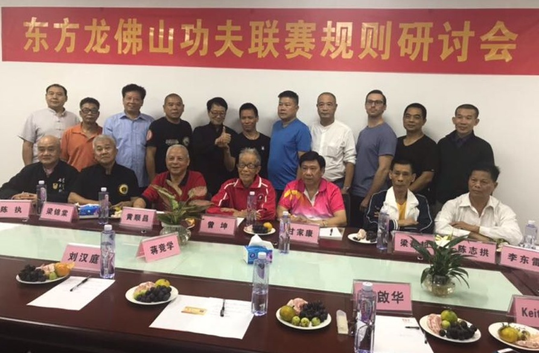

鶴山第二屆梁讚詠春文化節暨古勞水鄉旅遊嘉年華將於11月18日至20日在鶴山市體育館舉行。本屆文化節將推出詠春擂——2017年中國（鶴山）「梁贊杯」國際詠春拳邀請賽，擂台賽由國家體育總局武術運動管理中心、中國武術協會為指導單位，鶴山市人民政府、廣東省武術協會等主辦。在賽事規則方面，廣東省武術協會特邀請武林前輩、專家們研討及制定《廣東省詠春拳搏擊競賽規則》，對詠春拳的手法腿法肘法等作出明確的規範，並嚴禁使用詠春拳外的技法，凸顯詠春拳獨有的本質特徵。<!--more-->

\[caption id="attachment\_647" align="alignnone" width="893"\] 梁錦棠師父應邀參與研討及制定《廣東省詠春拳搏擊競賽規則》\[/caption\]

\[caption id="attachment\_645" align="alignnone" width="525"\] 梁錦棠師父應邀參與研討及制定《廣東省詠春拳搏擊競賽規則》\[/caption\]
