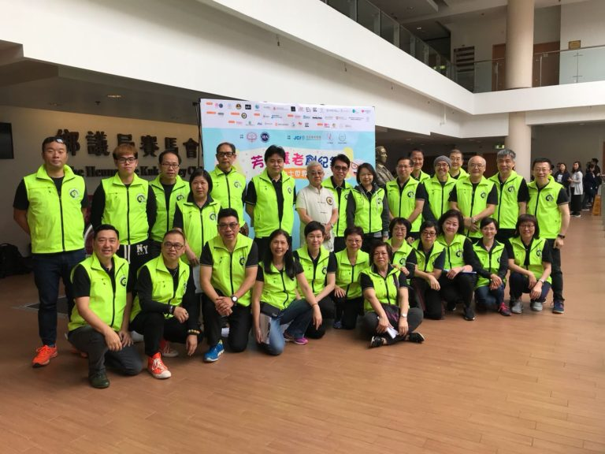
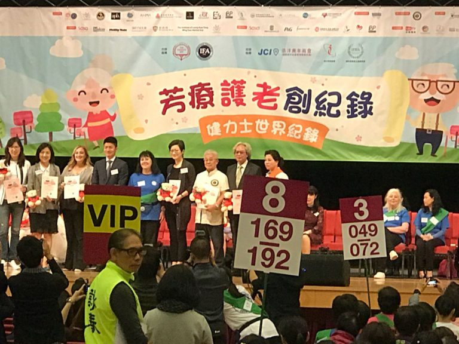
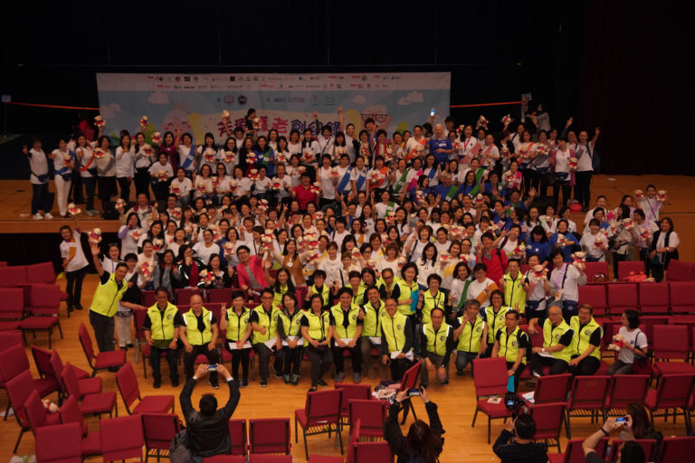

為響應國際衞生組織長者友善社區，香港化粧品同業協會與國際芳療師協會(IFA) 合作籌劃打破「最多長者同時接受專業手部按摩」的健力士世界記錄。<!--more-->

2018年3月26日，共有約300名芳香治療師為老人家以香薰按摩雙手。活動當天本會派出了30名義工作為獨立監察人，以證明是次活動為世界新紀錄。 \[caption id="attachment\_924" align="alignnone" width="768"\] 梁錦棠師父與本會義工在活動之前合照。\[/caption\]

\[caption id="attachment\_923" align="alignnone" width="768"\] 梁錦棠師父接受活動紀念品，以鳴謝提供義工支援。\[/caption\]

\[caption id="attachment\_922" align="alignnone" width="768"\] 活動完結之後，所有嘉賓、導師、參加者一同在台前合照。\[/caption\]
