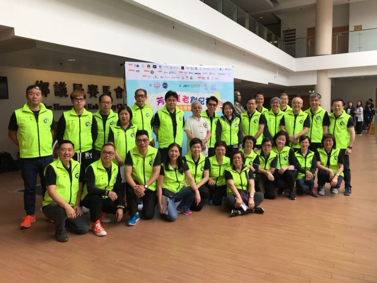
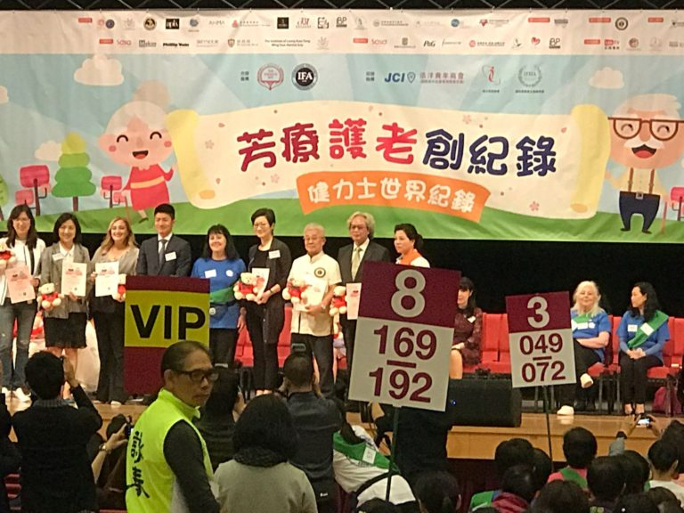
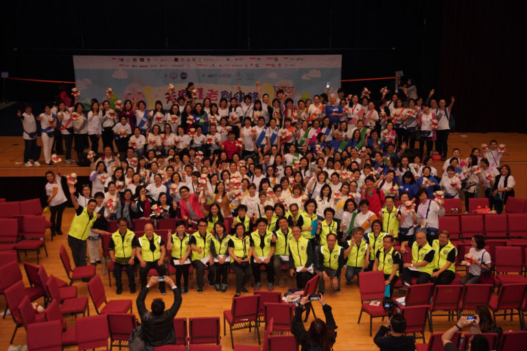

為響應國際衞生組織長者友善社區，香港化粧品同業協會與國際芳療師協會(IFA) 合作籌劃打破「最多長者同時接受專業手部按摩」的健力士世界記錄。<!--more-->

2018年3月26日，共有約300名芳香治療師為老人家以香薰按摩雙手。活動當天本會派出了30名義工作為獨立監察人，以證明是次活動為世界新紀錄。 <figure>
  
  <figcaption>梁錦棠師父與本會義工在活動之前合照。</figcaption>
</figure>

<figure>
  
  <figcaption>梁錦棠師父接受活動紀念品，以鳴謝提供義工支援。</figcaption>
</figure>

<figure>
  
  <figcaption>活動完結之後，所有嘉賓、導師、參加者一同在台前合照。</figcaption>
</figure>
