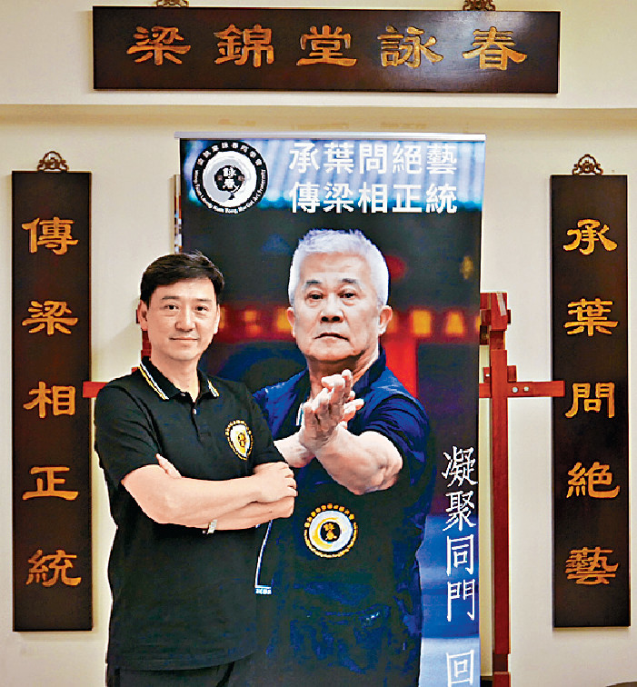

梁錦棠詠春同學會會長陳礎基先生接受《頭條日報》訪問，講述自己與師父結緣之經過及貢獻社會的原因。[勇闖高峰——退休行善多姿彩](http://hd.stheadline.com/news/columns/462/20180524/670970/) <!--more-->

\[caption id="attachment\_910" align="alignnone" width="701"\] 梁錦棠詠春同學會會長陳礎基先生接受《頭條日報》訪問\[/caption\]
