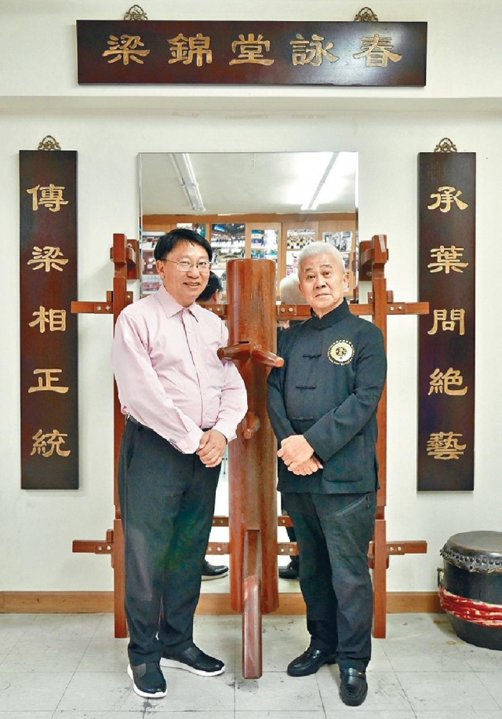

多謝香港商業專業評審中心榮譽會長余壽寧先生在《[頭條日報](http://hd.stheadline.com/news/columns/462/20180531/672656/)》的專欄，寫及與梁錦棠師父結緣和學習詠春的經過。<!--more-->

\[caption id="attachment\_917" align="alignnone" width="640"\] 梁錦棠師父或香港商業專業評審中心榮譽會長余壽寧先生合照 (頭條日報圖片)\[/caption\]

「幾廿歲喇，仲學咩！」我對這句話有點反感，世界不斷在變，持續學習，終身受用，如上星期提及的陳礎基就是退休後才習武，而他的師傅梁錦棠詠春國術研究會會長梁錦棠（圖右），亦是廿多歲才拜師學詠春，而今日在武術界獲得崇高地位，同時他亦持續鑽研，將詠春發揚光大。他說：「詠春是一門提升右腦發展的武術，同時亦可以幫助穩固下盤和提高專注力，對於小孩子和長者都是不錯的強身健體好運動。」

　　梁錦棠為何廿多歲才想到習武？「我天生身形較矮細，出來社會工作容易被人欺凌，於是就聯想到要習武傍身了，當時祖父就話學功夫要學詠春，因為較為斯文，我亦覺得切合我的性格。」因緣際會，梁錦棠認識了梁相師傅，梁師傅是詠春宗師葉問來港後的第一位弟子，當時就馬上拜師習武了。

　　今天梁錦棠已桃李滿門，徒弟徒孫已遍佈中國、香港、美加及馬來西亞等，他很樂意教授不同年紀人士，尤其兒童及長者，他說：「首先，詠春很多招式都鍛煉左手，兒童學可以幫助他們右腦的發展，對讀書和運動發展都有幫助。學詠春亦能提升專注力，對小孩子好人人都知，但事實上專注力都老人家都十分重要，因為長者日常生活的難題在於大腦想到的行為，手腳因為反應不來而失去協調引致跌倒，詠春一方面訓練肢體與腦袋協調，常見的黐手動作可提升觸覺和靈敏度，同時基本馬步能鍛煉下盤根基，這樣長者在家居發生意外的機會亦會隨之降低。」

　　梁錦棠師傅一直致力將詠春這們武術承傳下去，「詠春的好處是剛柔並重，不分年齡性別，體格強弱，只要有心學，就可以開始了。」
