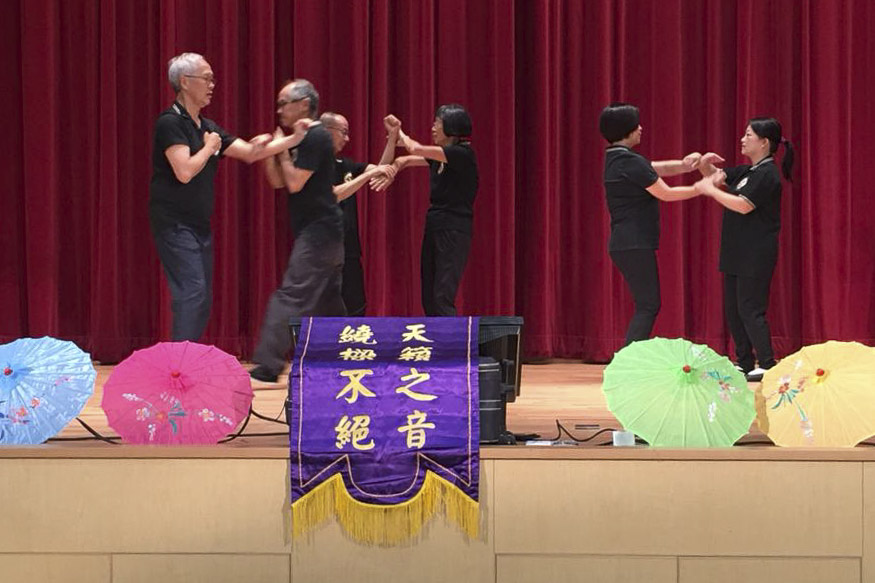

本會之先進組別會員受邀請出席白田社區會堂「老友記同慶中秋」活動，活動當中表演小念頭，希望把動感活力帶予在場觀眾。<!--more-->

\[caption id="attachment\_1117" align="alignnone" width="875"\] 本會成員參予白田社區會堂之長者同慶中秋活動，當中表演小念頭及黐手。\[/caption\]

\[caption id="attachment\_1118" align="alignnone" width="525"\] 本會成員參予白田社區會堂之長者同慶中秋活動，當中表演小念頭及黐手。\[/caption\]

\[caption id="attachment\_1119" align="alignnone" width="525"\] 本會成員參予白田社區會堂之長者同慶中秋活動，當中表演小念頭及黐手。\[/caption\]

