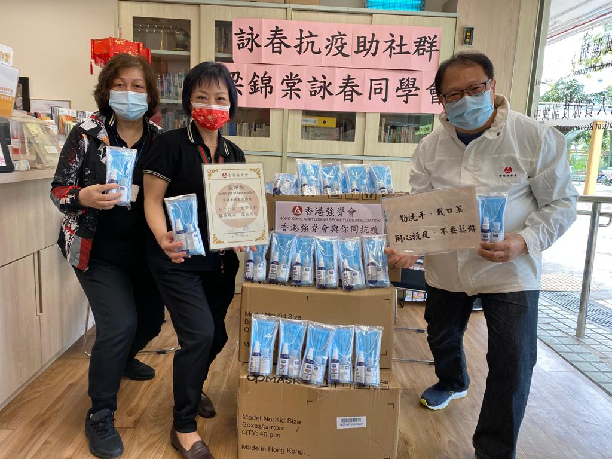
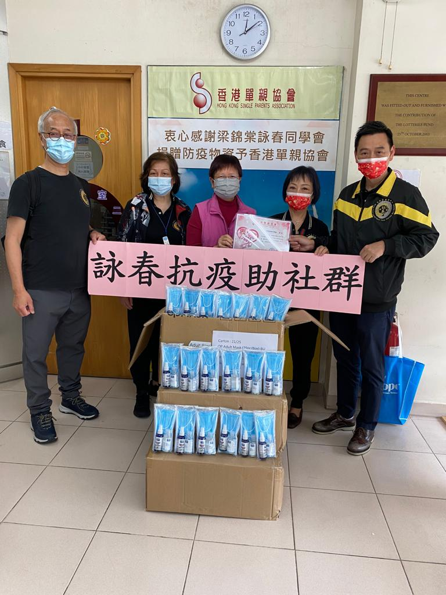

2021年2月，本會成員到以下慈善機構派發防疫物資，以幫助有需要的市民渡過困難。受惠機構包括：明愛荃灣服務中心、路向四肢傷殘人士協會、香港宣教會恩磐堂鄰舍服務中心、香港強脊會 、東華三院黃竹坑服務綜合中心、香港單親協會。

<!--more-->

<figure>

<figcaption>

香港宣教會恩磐堂鄰舍服務中心

</figcaption>

</figure>

<figure>

<figcaption>

明愛荃灣服務中心

</figcaption>

</figure>

<figure>

<figcaption>

路向四肢傷殘人士協會

</figcaption>

</figure>

<figure>

<figcaption>

香港強脊會

</figcaption>

</figure>

<figure>

<figcaption>

東華三院黃竹坑服務中心

</figcaption>

</figure>

<figure>

<figcaption>

香港單親協會

</figcaption>

</figure>
