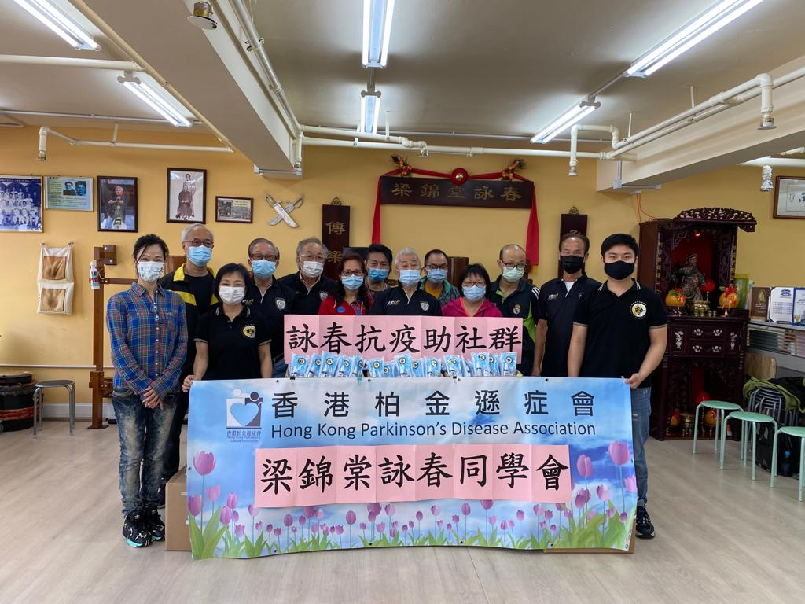
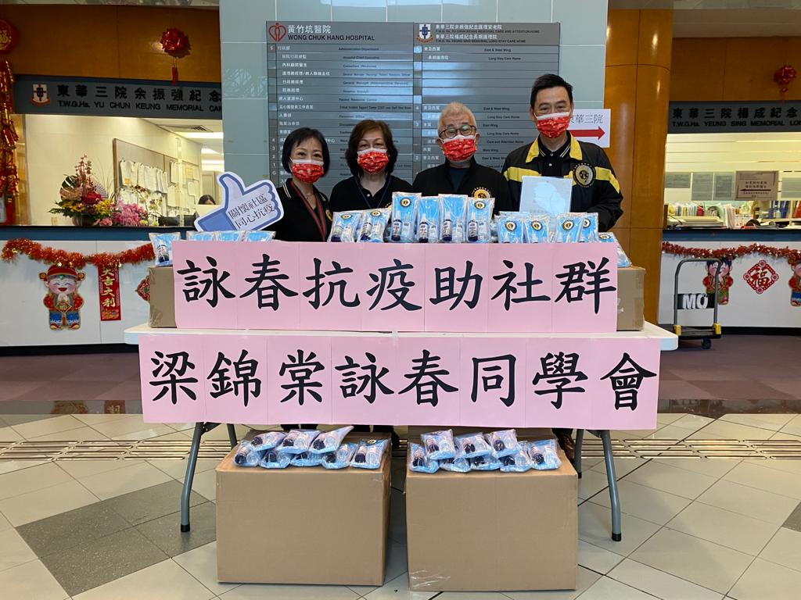
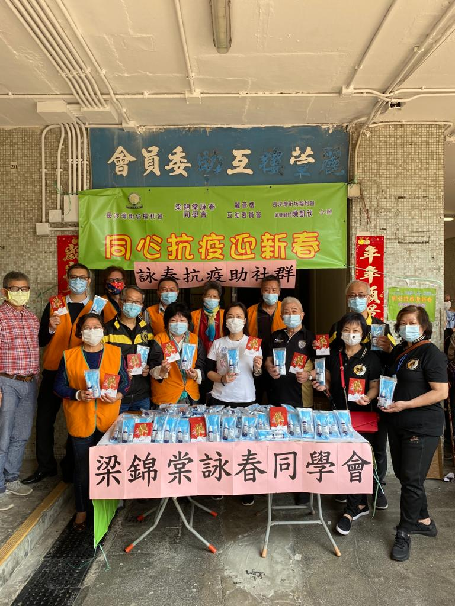
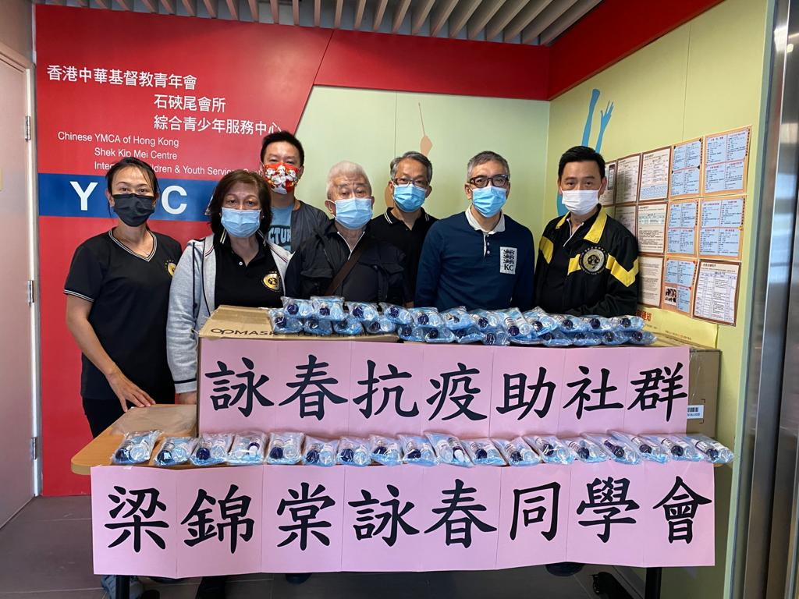

**2021度的慈善活動亦著重於協助社會防疫，因著疫症的爆發及防疫措施，未能如往年般舉辦各慈善院社的探訪活動**.**只能派發防疫用品給予各慈善機構.受惠機構名冊如下:**

- 香港展能藝術會
- 社企生果媽媽
- 婦女服務聯會, 葵涌蔣麗芸家庭服務中心
- 兒童心臟基金會
- YMCA 石硤尾會所
- 路向四肢傷殘人士協會
- 窩口明愛服務中心
- 香港宣教會恩磐堂
- 香港風濕病基金會
- 東華三院黃竹去坑護老院
- 德馨護理安老院
- 香港單親協會
- 香港柏日遜症會
- 長沙灣麗閣村互助委員會
- 基督教神愛護理院
- 深水埗街坊福利會.

