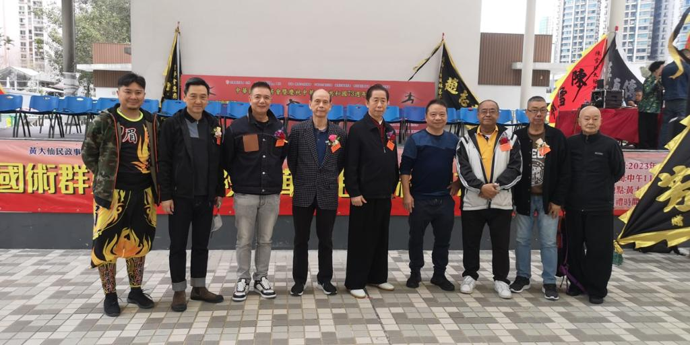
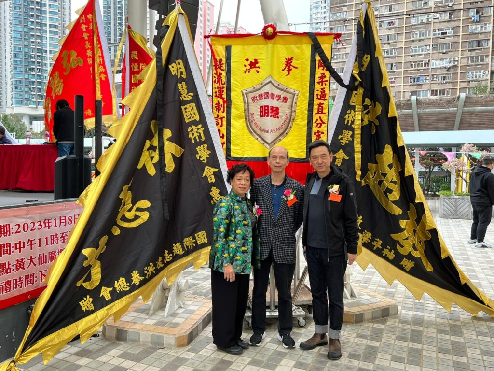
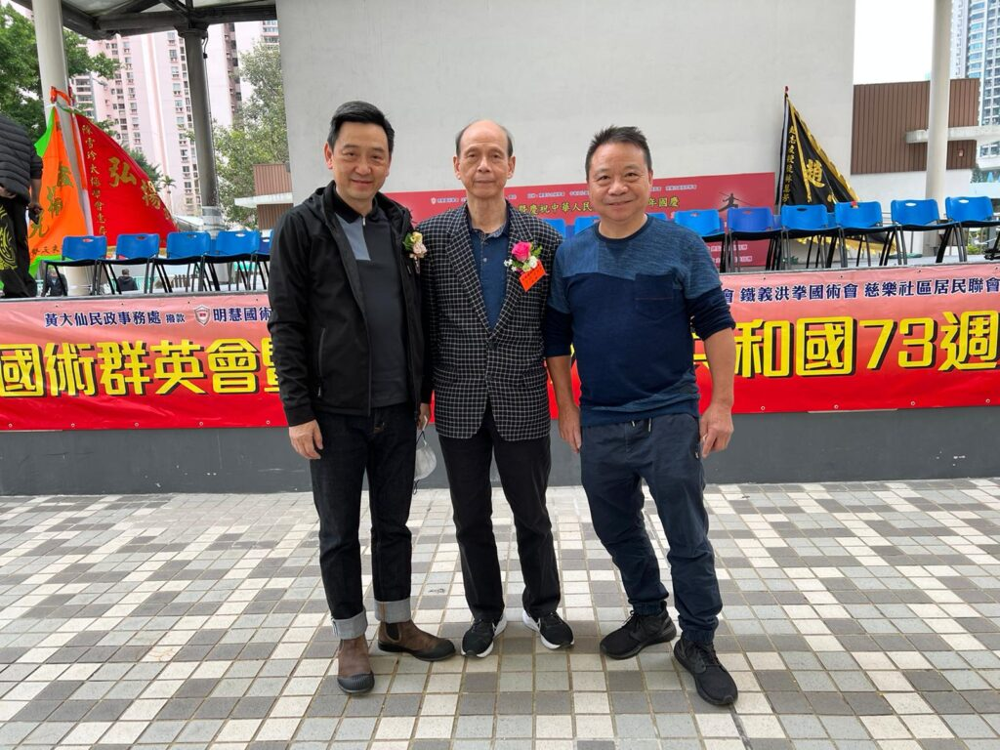
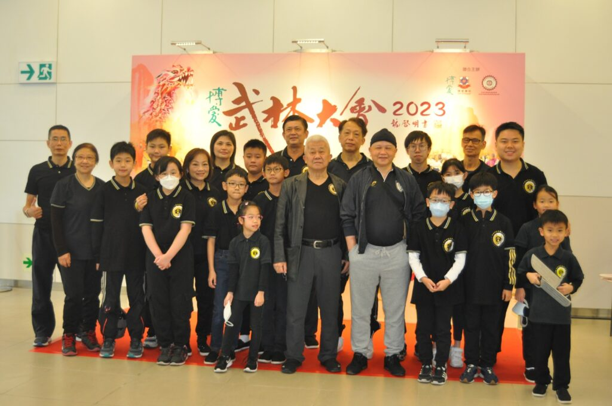
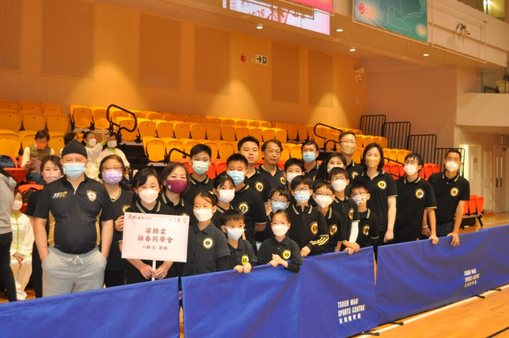
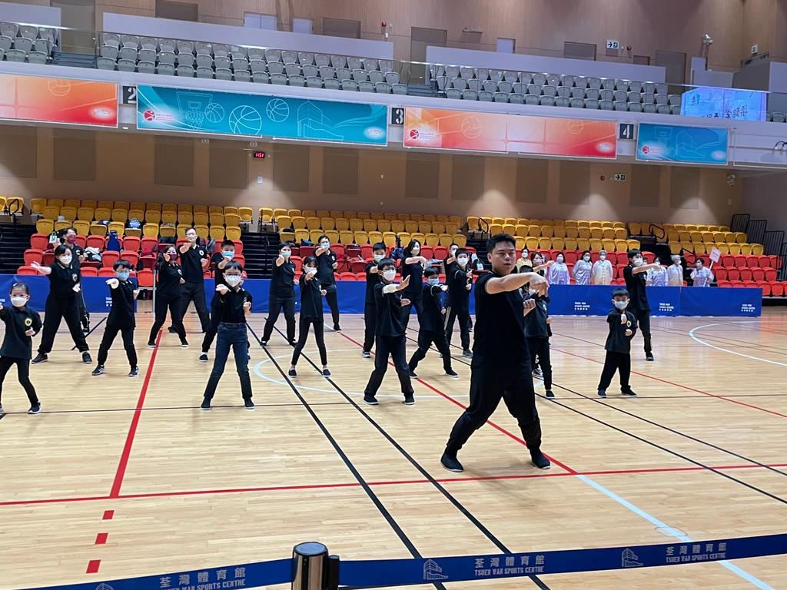
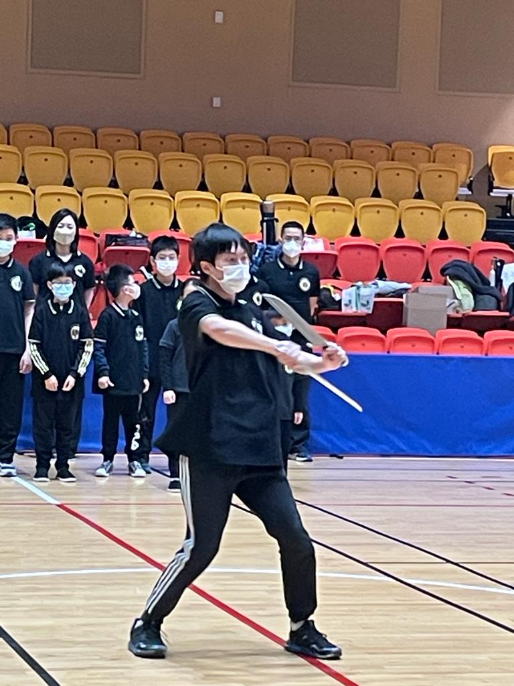
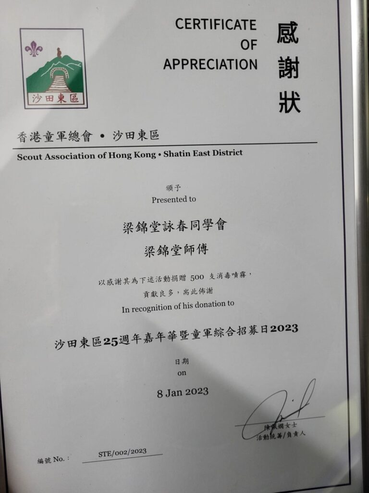

## 中華國術群英會暨慶祝中華人民共和國73週年國慶表演

本會前任會長，陳礎基先生代表出席參與中華國術群英會暨慶祝中華人民共和國73週年國慶表演

[]
中華國術群英會暨慶祝中華人民共和國73週年國慶表演

[]
中華國術群英會暨慶祝中華人民共和國73週年國慶表演

[]
本會前任會長，陳礎基先生（左一）代表出席中華國術群英會暨慶祝中華人民共和國73週年國慶表演

## 博愛武林大會2023

本會教練率領年青詠春學員出席假荃灣體育館舉行的[博愛武林大會2023](https://www.pokoi.org.hk/martialartperformance/ "博愛武林大會2023") 。

[]梁錦棠詠春同學會出席博愛武林大會2023

[]
梁錦棠詠春同學會出席博愛武林大會2023

[]
梁錦棠詠春同學會出席博愛武林大會2023

[]
梁錦棠詠春同學會出席博愛武林大會2023

## 沙田東區25週年嘉年華暨童軍綜合招募日2023

本會派出義工成員支援當日童軍活動。

[]
香港童軍總會沙田東區25週年嘉年華會