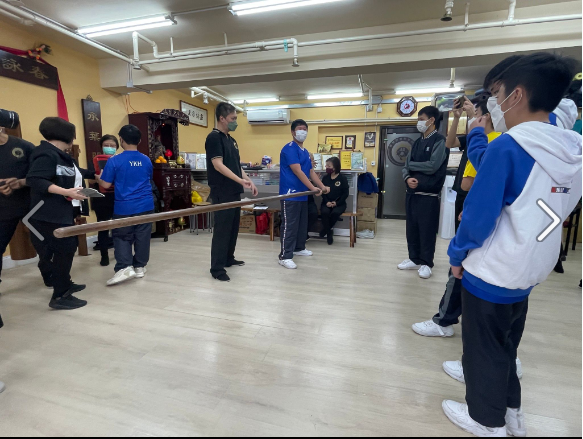
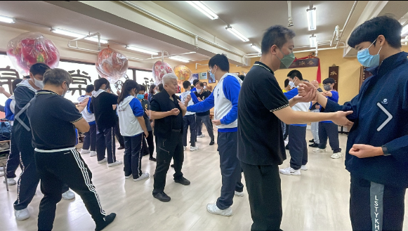
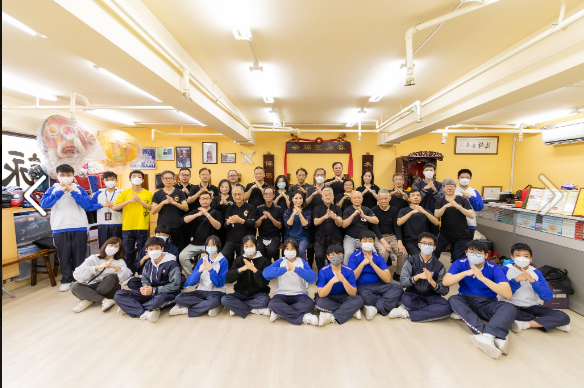
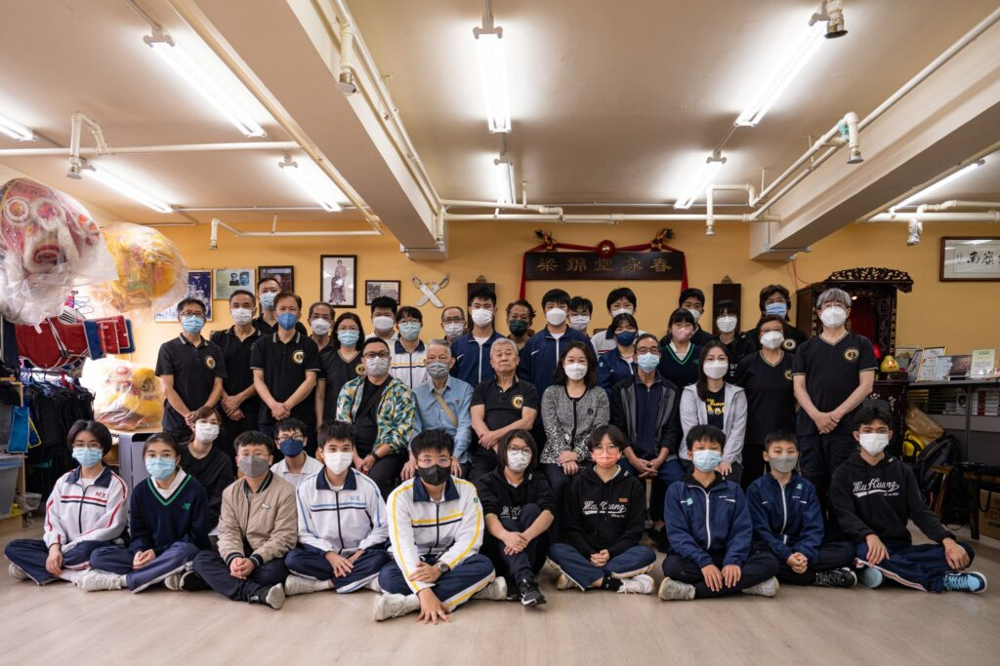
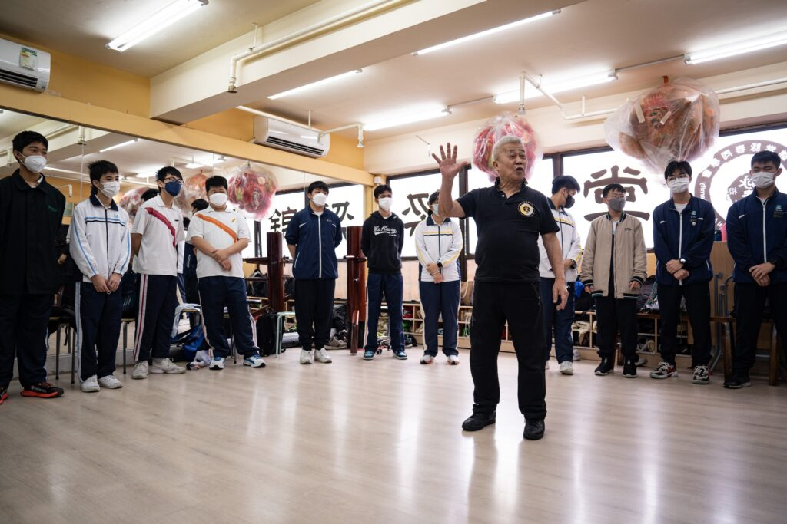
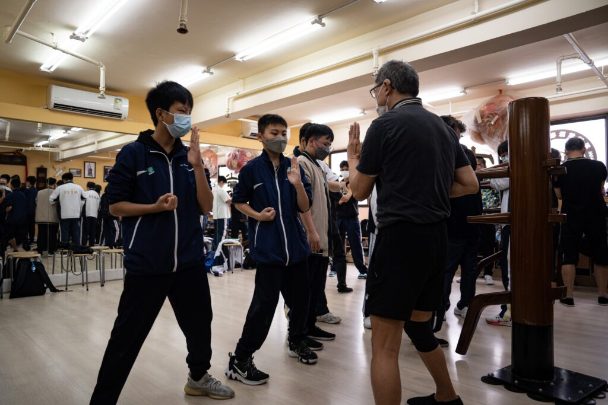
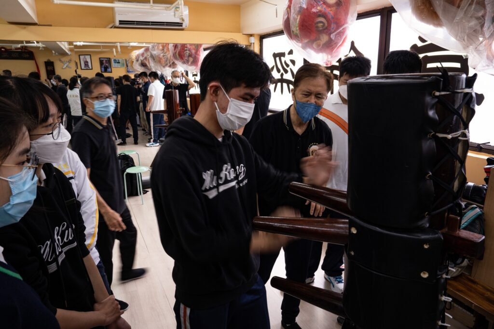

<figure>

<figcaption>

樂善堂余近卿中學 同學們試玩詠春拳,

</figcaption>

</figure>

<figure>

<figcaption>

梁錦棠師父指導樂善堂余近卿中學同學們打詠春拳

</figcaption>

</figure>

<figure>

<figcaption>

梁錦棠師父,李家文博士與樂善堂余近卿中學同學們合照

</figcaption>

</figure>

<figure>

<figcaption>

**梁錦棠師父與慕光中學同學們合照**

</figcaption>

</figure>

<figure>

<figcaption>

梁師父向同學們講解詠春拳.

</figcaption>

</figure>

<figure>

<figcaption>

同學們試打玩詠春拳

</figcaption>

</figure>

<figure>

<figcaption>

同學們接觸詠春木人樁

</figcaption>

</figure>
